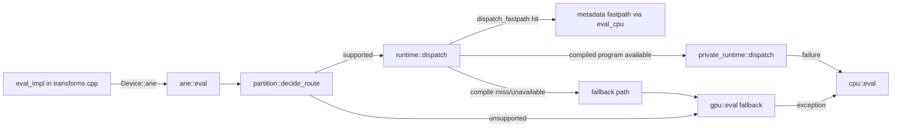
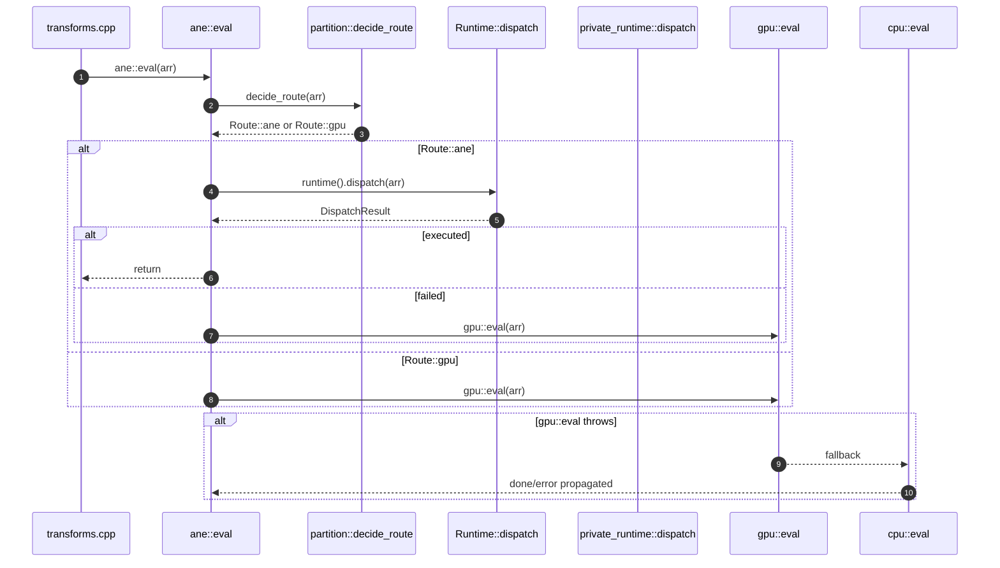

# MLX ANE Backend Implementation Guide

This document maps the ANE backend from MLX graph execution down to the private ANE runtime bridge.

## 1) High-level flow



- Entry point is still the graph scheduler (`eval_impl`) which dispatches by `array.primitive().device()`: GPU, ANE, or CPU.
- ANE-specific dispatch is inside `ane::eval` and decides whether to run on ANE or fallback.

## 2) Files by responsibility

| Layer | File | Role |
|---|---|---|
| Routing | `mlx-swift/Source/Cmlx/mlx/mlx/backend/ane/partition.*` | Decides ANE vs GPU route (`supported-op` / `unsupported-*`) and emits partition-boundary diagnostics. |
| Public ANE eval API | `mlx-swift/Source/Cmlx/mlx/mlx/backend/ane/eval.*` | Top-level `new_stream/finalize/synchronize/eval` entry points for ANE backend. |
| ANE runtime core | `mlx-swift/Source/Cmlx/mlx/mlx/backend/ane/runtime.*` | Dispatch orchestration, caching, fallback policy, and status reporting. |
| Private runtime bridge | `mlx-swift/Source/Cmlx/mlx/mlx/backend/ane/private_runtime.*` | Compile MIL, initialize ANE client/model/request, surface attachment management, and actual ANE evaluate call. |
| Support matrix | `mlx-swift/Source/Cmlx/mlx/mlx/backend/ane/support.*` | Primitive allowlist and conservative per-op constraints. |
| Surface helpers | `mlx-swift/Source/Cmlx/mlx/mlx/backend/ane/memory.*` | Shared surface buffer and array wrapping helpers. |
| Telemetry | `mlx-swift/Source/Cmlx/mlx/mlx/backend/ane/diagnostics.*` | Counters, logs, and atexit summary hooks. |
| Device info | `mlx-swift/Source/Cmlx/mlx/mlx/backend/ane/device_info.*` | Availability and device metadata facade on top of GPU-device info. |

## 3) Routing and fallback graph



Route behavior details:
- `partition::decide_route` first checks primitive allowlist, then per-array constraints.
- If route isn’t ANE, it immediately falls back to GPU.
- ANE path still has internal fastpath and dispatch failure handling.

## 4) Runtime dispatch internals (`Runtime::dispatch`)

```mermaid
flowchart TD
    A[Runtime::dispatch(arr)] --> B{metadata_fastpath_primitive?}
    B -->|yes| C[private_runtime::dispatch_fastpath]
    B -->|no| D[get_or_compile under lock]
    C -->|ok| Done1[return executed]
    C -->|fail| D
    D --> E[primitive_cache keyed by primitive_id]
    D --> F[compile_cache keyed by structure key]
    D --> G[private_runtime::compile if runtime available]
    G -->|ok| H[Program cached]
    G -->|fail| I[dispatch failure reason]
    H --> K[private_runtime::dispatch]
    K -->|ok| Done2[success]
    K -->|fail| Done3[compile_missing/runtime_unavailable/failed]
```

- `Runtime` is a mutex-protected singleton (`Runtime::instance`).
- Two caches are maintained:
  - `primitive_cache_`: exact primitive-id cache with shape/dtype validation via `program_matches`.
  - `compile_cache_`: reusable compile key (primitive + input/output dtypes/shapes + optional RMS eps + op name).
- `private_runtime_enabled` gate (`MLX_ANE_PRIVATE_RUNTIME`) is checked once in `try_initialize_runtime()`.

## 5) Private runtime bridge details

### 5.1 Initialization

`private_runtime::available()` acquires a runtime mutex, then:
- `dlopen` AppleNeuralEngine private framework.
- Resolve classes: `_ANEClient`, `_ANEModel`, `_ANERequest`, `_ANEIOSurfaceObject`.
- Get shared connection.
- Cache reason strings for failures.

### 5.2 MIL generation and model load

`private_runtime::compile(arr, reason)`:
- Calls `build_mil(arr, mil, reason)`.
- Writes `model.mil` into a temp dir.
- Creates ANE model object and calls private runtime `compileModel` + `loadModel` with fixed options (`kANEFModelType=kANEFModelMIL`).
- Stores input/output indices and allocates output surface pools.

Supported generated ops are conservative and include:
- elementwise arithmetic (fp16 only, no broadcast), unary ops, reshape/view-like ops, transpose, concatenate, slice, matmul, softmax, cast, sigmoid, and compiled sigmoid-multiply.
- higher-rank inputs are normalized to 4D MIL shape by collapsing leading dims.

### 5.3 Dispatch path

`private_runtime::dispatch(program, arr)` stages and executes:
1. Synchronize producer streams for non-ready inputs.
2. Ensure every ANE input has a reusable surface attachment:
   - reuse existing attachment when valid and sized,
   - otherwise create IOSurface once, copy current input bytes once, and install attachment.
3. Build request with input/output wrappers and indices.
4. Call `evaluateWithModel` on ANE client.
5. Bind each output IOSurface directly to output arrays (pool-backed attachment path); if bind fails, dispatch fails.

Resource lifecycle:
- `ANESurfaceAttachment` destructor either returns handle to pool or releases it.
- `Program` destructor unloads the model and removes temp model directory.

## 6) 4D MIL normalization + constraints

- `normalize_shape_for_mil` collapses rank > 4 tensors to `[prod(prefix), d[-3], d[-2], d[-1]]`.
- Layout constraints currently require `row_contiguous` IO for both compile and dispatch.
- For some ops constraints are stricter:
  - binary ops: same shape + fp16 only in build gate for current binary path.
  - transpose/slice/concat enforce axis rank checks and axis mapping against MIL 4D.
  - rmsnorm expects last normalized dimension for invd and optional eps.

## 7) Diagnostics, profiling, and env flags

### Diagnostics (`diagnostics.*`)
- Counters include: total/supported ops, ANE dispatches, GPU/CPU fallbacks, compile cache hits/misses, partition boundaries.
- Controlled via: `MLX_ANE_DEBUG`, `MLX_ANE_DIAGNOSTICS`, `MLX_ANE_VERBOSE`, `MLX_ANE_REPORT_FALLBACKS`.
- Optionally logs route events and partition boundaries.

### Profiling (`runtime.cpp`, `eval.cpp`, `private_runtime.mm`)
- Unified counters for:
  - dispatch timing, compile timing, stream sync, attachment/copy setup, request/build/eval, profile periodic output.
- Controlled via `MLX_ANE_PROFILE` and `MLX_ANE_PROFILE_EVERY`.

### Feature/result-control flags
- `MLX_ANE_PRIVATE_RUNTIME` (gate private runtime path)
- `MLX_ANE_METADATA_FASTPATH`
- `MLX_ANE_STRICT_INPUT_READY`
- `MLX_ANE_EXPERIMENTAL_ZERO_COPY_ATTACH` (opt-in no-memcpy first-touch input attach attempt with fallback)
- `MLX_ANE_DUMP_MIL`
- `MLX_ANE_RUNTIME_VERBOSE` (or `MLX_ANE_VERBOSE`)

## 8) Device abstraction note

`ane::is_available()` delegates to GPU availability in current implementation (`device_info` mirrors GPU info and sets backend name `ane`). This means ANE backend sits on top of GPU runtime infrastructure for stream sync/finalization semantics.

## 9) Non-ANE build/runtime fallback

If `MLX_BUILD_ANE` is off, CMake selects `backend/no_ane` where `ane::eval/new_stream/finalize/synchronize` raise "ANE backend is not available".

---

## Suggested mental model

If you want a quick way to reason:
1. `transforms.cpp` chooses backend by array device.
2. ANE evaluator first asks "can this op stay in ANE constraints?".
3. If yes, it tries metadata fastpath, then compiled ANE dispatch.
4. If any ANE step fails, execution falls back to GPU then CPU.
5. Profiling/diagnostics are orthogonal observers controlled by env vars and don’t change semantics unless gates disable execution.
