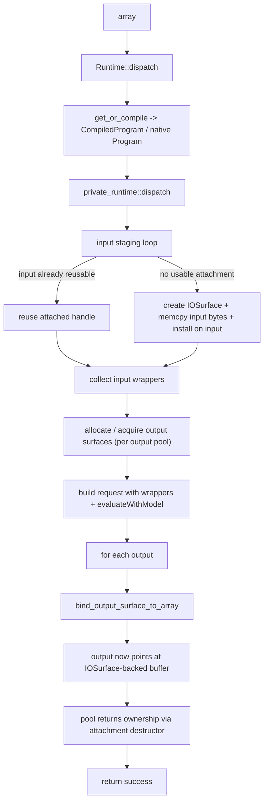

# ANE Memory Layer (Detailed, current)

This document describes how ANE memory is prepared and moved in the current
private-runtime dispatch path and how pinning works today.

## 1) Memory layers and intent

- Array layer: regular `mlx::core::array` ownership, `allocator::Buffer`, flags, and metadata.
- ANE layer: `IOSurface` + `ANEIOSurfaceObject` objects used by the private ANE API.
- Transition layer: an array-side attachment (`ANESurfaceAttachment`) that ties an `array`
  to a specific IOSurface handle and optional pool ownership.

Goal in the current code path:

- Minimize dispatch-to-dispatch host/device movement once an array has already been
  attached.
- Keep output tensors directly backed by ANE result surfaces when possible.

## 2) Array-side attachment model

`array` stores a typed attachment on `array::Data`:

- `set_data_attachment(type_tag, attachment)`
- `data_attachment(type_tag)`
- `Flags` and `offset/strides` remain array metadata.

Attachment matching is strict pointer equality of `type_tag`, so ANE uses a dedicated
tag from `ane_surface_attachment_type_tag()` rather than RTTI.

Key implication:

- `reusable_input_attachment(...)` is effectively a metadata predicate:
  `row_contiguous == true`, attachment exists, attached handle is valid, and attached
  capacity (`nbytes`) is enough for required bytes.

## 3) ANE attachment data structures

`ANESurfaceAttachment` lives in
`Source/Cmlx/mlx/mlx/backend/ane/private_runtime.mm` and carries:

- `SurfaceHandle { IOSurfaceRef surface; id wrapper; }`
- `nbytes`
- optional `std::shared_ptr<SurfacePool> pool` for output pooling

`SurfacePool`:

- owns `vector<SurfaceHandle> free_handles`
- `acquire(...)` / `recycle(...)`

Lifecycle:

- If `pool` is present at destruction, handle goes back to the pool.
- Otherwise, IOSurface is `CFRelease`d.

## 4) What `ane/memory.cpp` currently provides vs what dispatch uses

Public ANE memory helpers (`ane/memory.h/.cpp`) are currently copy-oriented:

- `allocate_surface(bytes)` -> aligned IOSurface.
- `wrap_array_to_surface(arr)` -> copy `arr` bytes into new surface.
- `unwrap_surface_to_array(surface, arr)` -> copy surface bytes into array.

These helpers are not the dispatch hot path in current private runtime.

The dispatch path uses its own local attachment helpers inside
`private_runtime.mm`:

- `ensure_input_surface_attachment(...)`
- `install_surface_handle_on_array(...)`
- `bind_output_surface_to_array(...)`

## 5) Dispatch-time memory flow (private runtime)

Current details in `private_runtime.mm`:

- Inputs:
  - `ensure_input_surface_attachment(in, required_nbytes)`:
    - requires `in.flags().row_contiguous`
    - if `MLX_ANE_EXPERIMENTAL_ZERO_COPY_ATTACH=1`, first attempts a no-memcpy
      alias attach from existing input address (`offset == 0` safety check).
    - if reusable attachment present and big enough: no new copy.
    - otherwise: allocate a new surface, lock it, `memcpy` from `in.data<char>()`,
      unlock, then install attachment on the same `in`.
- Outputs:
  - each output gets `dispatch_output_handles[i]`.
  - each handle is acquired from `program.output_pools[i]` or created new.
  - `bind_output_surface_to_array(out, &handle, required_nbytes, pool)` installs the
    output surface into `out` via `install_surface_handle_on_array`.
  - output copy-to-host fallback does not happen in dispatch; bind must succeed or
    dispatch fails.

## 6) Zero-copy status (what is and is not zero-copy now)

- Repeated use of the same attached input avoids re-copying input bytes (true reuse).
- Outputs are directly written by ANE into output-arrays’ attached surfaces (no
  intermediate host copy in dispatch path).
- Experimental mode (`MLX_ANE_EXPERIMENTAL_ZERO_COPY_ATTACH=1`) attempts first-touch
  input attach without memcpy; if alias creation fails, it deterministically falls
  back to memcpy-attach.
- Still copy-based in these cases:
  - first input attachment path when input has no suitable ANE attachment.
  - any path where `in.data()` itself triggers staging/copy from non-CPU
    memory.
  - any path outside private-runtime ANE (e.g. metadata fastpath or other backends).
- There is no longer an explicit `MLX_ANE_ENABLE_IOSURFACE` wrapping branch in
  `Runtime::dispatch`.

## 7) Pinning behavior

`ANE.pinToSurface(array)` and `Runtime::pin_to_surface(array)` still map to:

- `private_runtime::pin_to_surface(array, reason)`
- which calls `ensure_input_surface_attachment(arr, arr.nbytes(), ...)`

So pinning now uses the same attachment machinery as dispatch.

Pinning / attachment preconditions in `ensure_input_surface_attachment`:

- runtime initialization available
- `in.flags().row_contiguous == true`
- data pointer from `in.data<char>()` must be non-null
- input must not be `array::Status::unscheduled` at call sites that check it
- no strict offset check is currently enforced in attachment path

Dispatch differs slightly by:

- synchronizing required streams when inputs are not available.
- continuing (or failing based on `MLX_ANE_STRICT_INPUT_READY`) if some inputs
  remain unavailable after sync.

## 8) Memory ownership and lifecycle

- `Program` owns model/model_dir and per-output `SurfacePool`s.
- Input attachments installed by ensure/pin:
  - `pool == nullptr` by default, so destruction releases surface unless user/protocol
    later reuses via attached object.
- Output attachments install with `pool` so they are recycled when array attachment is
  destroyed.
- Attachment installation stores an `allocator::Buffer` pointing to
  `IOSurfaceGetBaseAddress(surface)`, then stores side attachment object.
- Pool-backed attachment destruction is counted in profile as
  `attach_lifecycle_releases_with_pool`.

## 9) Zero-Copy Experiment Instrumentation

When profiling is enabled, `private_runtime.mm` additionally reports:

- `zero_copy_attach_attempts`
- `zero_copy_attach_success`
- `zero_copy_attach_fallback_memcpy`
- `zero_copy_attach_fallback_reasons` (bucketed string summary)
- per-input CSV-style decision lines:
  - `[ane::attach_csv] idx=...,path=...,bytes=...,ns=...,reason=...`

## 10) Compatibility and guardrails

- Works only when:
  - array is row-contiguous for ANE attachment use.
- Failure modes to expect:
  - output pool/acquire failure,
  - missing/invalid surface wrapper,
  - IOSurface create/lock/baseAddress failures,
  - unavailable output binding.
- Metadata fastpath (`MLX_ANE_METADATA_FASTPATH`) is separate and may dispatch on CPU
  directly for supported unary/view ops.

## 11) Clarification on unified memory

Even on Apple Silicon unified-memory systems, ANE dispatch still expects IOSurface-backed
objects (`ANEIOSurfaceObject`) and explicit wrappers. Unified DRAM removes physical
separation but does not remove the ANE transport contract.

So “zero-copy” in this codebase currently means:

- no additional host copy between ANE request/response and array memory once attached, and
- reuse of the same surface attachment across calls where possible,

rather than absolute memory aliasing from arbitrary MLX allocator buffers into ANE.

## 12) Practical guidance

- If you hit repeated ANE dispatches over the same input shapes, allow automatic/explicit
  attachment to establish stable ANE surfaces and minimize copies.
- Ensure inputs are row-contiguous for better attachability.
- Any non-row-contiguous input likely falls back to failure in the private ANE path.
